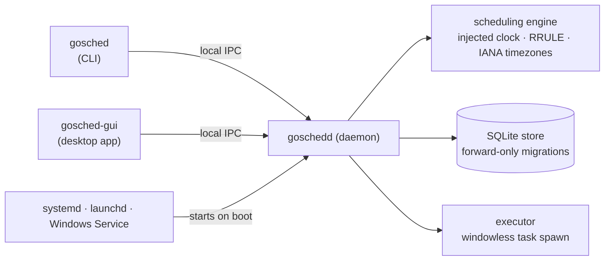

# go-schedule

[](https://github.com/shruggietech/go-schedule/actions/workflows/ci.yml)
[](https://github.com/shruggietech/go-schedule/releases/latest)
[](LICENSE)
[](https://shruggietech.github.io/go-schedule/)

**A cross-platform task scheduler with cron's power and none of its syntax.**\
**Platforms:** Linux · macOS · Windows\
**Interfaces:** CLI, desktop GUI, and a system-wide background daemon\
**Documentation:** [shruggietech.github.io/go-schedule](https://shruggietech.github.io/go-schedule/) · **Changes:** [CHANGELOG.md](CHANGELOG.md)

`cron` is powerful, and `*/15 * * * *` is hard to read and easy to get wrong.
go-schedule takes the same scheduling power and lets you write it the way you
would say it — "every 15 minutes", "every weekday at 9:00 AM", "the 3rd
Wednesday of each month" — or schedule a single one-off run. A background daemon
keeps the schedule whether or not any window is open, and a Material Design
desktop app gives you a calendar view of it all.

## Contents

- [Why](#why)
- [What it does](#what-it-does)
- [Install](#install)
- [Quick start](#quick-start)
- [Architecture](#architecture)
- [Project layout](#project-layout)
- [Development](#development)
- [Contributing](#contributing)
- [License](#license)

## Why

Scheduling is one of those problems where the hard part is not the scheduling.
It is knowing whether the thing you scheduled will actually fire, at the right
moment, in the right timezone, after the laptop was asleep, without piling up
forty copies of itself.

go-schedule is built around that. Schedules are written in plain language and
echoed back the way the scheduler understood them, so a misreading is visible
immediately rather than at 02:30 tomorrow. Times resolve in a real IANA
timezone, so a Daylight Saving transition moves the run rather than breaking it.
Missed runs produce **one** catch-up, not a stampede. And when a run is still
going as the next comes due, an explicit overlap policy decides what happens
instead of leaving it to chance.

## What it does

**Schedules, written in plain language.** Recurring or one-off, with anything
cron can express — intervals, ordinal weekdays, monthly patterns — and no cron
strings. Under the hood it is RFC 5545 recurrence, which is what makes the
human-readable layer honest rather than a lossy translation.

**Timezones that hold up.** Every task carries an IANA timezone. Scheduling is
computed in UTC and presented in the task's zone, with explicit next-valid and
first-occurrence handling across DST transitions — the two cases that quietly
break naive schedulers twice a year.

**Runs that survive the machine.** The daemon registers as a system service
(systemd, launchd, or a Windows service), so the schedule starts on boot and
keeps running with nobody logged in. After downtime, each task that missed runs
gets exactly one catch-up run and then resumes normally.

**Control over collisions.** Overlap policy is per task: queue one pending run
(the default), skip the new one, or allow them to run concurrently.

**A calendar that admits what it cannot do.** A task on the 31st, on 29
February, or on the fifth Friday will meet months that have no such date. Rather
than firing seven months in twelve and saying nothing, each task states what it
should do — skip the period, fall back to the last valid date, or roll into the
next one — and the schedule describes itself accordingly.

**Bring your crontab.** `gosched cron import` reads an existing crontab, shows
you what every line means in plain language and when it would next run, and
creates the tasks — with `--dry-run` to see the whole thing before anything
changes. `gosched cron explain` translates a single expression, and `gosched
cron export` gives your jobs back as cron. Anything that cannot be carried across
faithfully is refused by name rather than approximated. Cron never becomes an
input language: see [Cron interoperability](docs/cron.md) for the fidelity table.

**Groups that nest.** Tasks live in groups, groups live in groups, and enabling
or disabling one cascades through its whole subtree — one command to silence a
region of the schedule.

**A desktop app, not a wrapper.** A Go-native Material Design GUI with calendar
and schedule views, a guided task editor that previews the schedule as you build
it, a group tree, and a live Logs view. Opening it never leaves a console window
behind. See the [GUI field reference](docs/gui-fields.md) for what each editor
field accepts.

## Install

Every [release](https://github.com/shruggietech/go-schedule/releases/latest)
ships installers and archives per platform. Verify downloads against
`SHA256SUMS.txt`; the artifacts are not signed.

| Platform | Download | Guide |
| --- | --- | --- |
| **Windows** | `go-schedule_<ver>_windows_amd64.msi` | [Windows install guide](docs/INSTALL-windows.md) |
| **macOS desktop** | `go-schedule-desktop_<ver>_darwin_<arch>` | [macOS install guide](docs/INSTALL-macos.md) |
| **Linux / headless** | `go-schedule_<ver>_<os>_<arch>.tar.gz` | [Linux install guide](docs/INSTALL-linux.md) |

On **Windows**, the `.msi` is a formal system installer: it installs to *Program
Files*, registers the scheduler as an auto-starting Windows service, adds itself
to `PATH`, and adds a Start-Menu shortcut. Uninstall through *Apps & features*.

On **macOS**, the desktop bundle is self-contained — the GUI, daemon, and CLI in
one `.app` — and starts the daemon itself on first launch. That daemon is not a
service, so if you want the schedule to survive a reboot, register the service
as well. The macOS guide covers this; it is the one thing people miss.

On **Linux**, the archive holds the daemon and CLI, both cgo-free, with nothing
to compile. Register the service and it starts on boot.

## Quick start

Install, register the service, then confirm the daemon is answering:

```sh
sudo gosched service install
sudo gosched service start
gosched health
```

```text
daemon ok (version 0.7.0)
```

Create a task:

```sh
gosched task add nightly-backup \
  --command /usr/local/bin/backup.sh \
  --schedule "every day at 02:30" \
  --tz America/New_York
```

It replies with how it understood you, and when it will next fire:

```text
created task 6f1c… (nightly-backup)
schedule: every day at 02:30 (America/New_York)
next runs:
  2026-07-24T06:30:00Z
  2026-07-25T06:30:00Z
```

Do not wait until 02:30 to find out whether it works:

```sh
gosched task run-now 6f1c…
gosched runs --task 6f1c…
```

Then open the desktop app, if you installed it:

```sh
gosched gui
```

Every command and flag is in the [CLI reference](docs/cli.md). On Windows the
commands are identical — open a **new** PowerShell after installing, so the
`PATH` entry is visible.

**Proving an install, properly.** The
[maintainer test scripts](docs/test-scripts.md) demonstrate that a real,
installed daemon fires on time, survives restarts, catches up after downtime,
and honors its overlap policies — with recorded evidence rather than a hopeful
glance at a log.

## Architecture

A single background **daemon** hosts everything that matters: the scheduling
engine, the SQLite store, and the executor. The CLI and the desktop GUI are thin
clients over a local IPC endpoint, so they act on identical state and neither
one owns the schedule.



IPC is a Unix domain socket on Linux and macOS, a named pipe on Windows. Because
the engine lives in the daemon rather than in a client, closing the GUI does not
stop the schedule — and the CLI and GUI can never disagree about what is
scheduled.

The full design is in
[`specs/001-task-scheduler/plan.md`](specs/001-task-scheduler/plan.md).

## Project layout

```text
cmd/        goschedd (daemon) · gosched (CLI) · gosched-gui (Fyne GUI)
internal/   engine · schedule · task · store · executor · catchup · timezone
            api · ipc · service · config · platform · logbus · autostart
gui/        Fyne views — schedule list, calendar, editor, groups, logs
test/       integration tests · maintainer test scripts
docs/       install guides · CLI reference · GUI fields · test scripts
specs/      spec-driven development artifacts
```

## Development

Development is spec-driven, via [Spec Kit](https://github.com/github/spec-kit).
The source of truth lives under
[`specs/001-task-scheduler/`](specs/001-task-scheduler/):

- [`spec.md`](specs/001-task-scheduler/spec.md) — what and why
- [`plan.md`](specs/001-task-scheduler/plan.md) — architecture and tech choices
- [`tasks.md`](specs/001-task-scheduler/tasks.md) — dependency-ordered task list
- [`contracts/`](specs/001-task-scheduler/contracts/) — CLI and local API contracts

Later features have their own directories under `specs/`. Engineering standards
are governed by the project
[constitution](.specify/memory/constitution.md): `gofmt`, `go vet`, and
`golangci-lint` clean, `go test -race` green, at least 80 percent coverage on
core packages, and a documented dispatch-latency budget.

The daemon and CLI are cgo-free. The GUI needs a C toolchain and OpenGL to
build, which CI and the release workflow provide; on Windows it is built
windowless and spawns tasks with no console window.

## Contributing

Please read [CONTRIBUTING.md](CONTRIBUTING.md) first — this project is
trunk-based and spec-driven, and both differ from the usual defaults. Bugs and
feature requests go through
[the issue forms](https://github.com/shruggietech/go-schedule/issues/new/choose);
security reports go through the private route in [SECURITY.md](SECURITY.md).
Participation is governed by our [Code of Conduct](CODE_OF_CONDUCT.md).

## License

Licensed under the [Apache License 2.0](LICENSE).
© 2026 [ShruggieTech](https://shruggie.tech).
