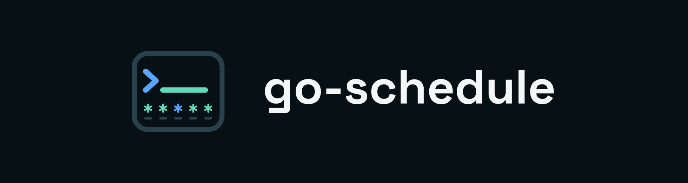

# go-schedule brand system

Use this page to choose approved artwork for documentation, integrations, release notes, screenshots, and other external surfaces. The complete source of truth lives in the repository's [`brand/` directory](https://github.com/shruggietech/go-schedule/tree/main/brand); the downloadable [brand guide](assets/brand/brand-guide.pdf) contains the full construction and usage system.

The governing idea is **familiar scheduling, explicit behavior**. The mark combines a terminal prompt, a ready-state cursor, and five schedule cells. The practical promise is **Know the next run.**

## Choose the right logo

| Context | Use | Download |
| --- | --- | --- |
| General use at 36 px or larger | Full transparent mark | [SVG](assets/brand/go-schedule-mark-color.svg) · [PNG](assets/brand/go-schedule-mark-color-1024.png) |
| Browser, title bar, or other use at 32 px or smaller | Reduced mark | [SVG](assets/brand/go-schedule-mark-reduced.svg) · [PNG](assets/favicons/favicon-256x256.png) |
| Dark surface | Full-color horizontal lockup | [SVG](assets/brand/go-schedule-horizontal-color.svg) · [PNG](assets/brand/go-schedule-horizontal-dark-2400.png) |
| Light surface | Black or light-surface lockup | [Black SVG](assets/brand/go-schedule-horizontal-black.svg) · [Color SVG](assets/brand/go-schedule-horizontal-light.svg) |
| Single-color production | White or black mark | [White SVG](assets/brand/go-schedule-mark-white.svg) · [Black SVG](assets/brand/go-schedule-mark-black.svg) |
| Social and link previews | Approved 1280 × 640 composition | [PNG](assets/brand/go-schedule-social-preview-1280x640.png) · [SVG](assets/brand/go-schedule-social-preview.svg) |

The mark may stand alone. Use a lockup when the audience may not already recognize the product. Keep clear space around the artwork equal to one schedule cell, and preserve the supplied proportions.

## Color

The core palette is Night `#071014`, Interval Mint `#62D9B7`, Anchor Blue `#58A6FF`, Hold Amber `#F2B84B`, and Stop Red `#E05F5F`.

| Token | Role | Dark-surface contrast |
| --- | --- | --- |
| Interval Mint `#62D9B7` | Recurrence, ready state, primary identity | 11.09:1 on Night |
| Anchor Blue `#58A6FF` | Exact run points, links, and focus | 7.60:1 on Night |
| Hold Amber `#F2B84B` | Pending policy and warnings | 10.73:1 on Night |
| Stop Red `#E05F5F` | Failure and destructive state | 5.46:1 on Night |

Interval Mint is not accessible for text on the Paper surface. Use the light-surface tokens defined in [`brand.tokens.json`](https://github.com/shruggietech/go-schedule/blob/main/brand/tokens/brand.tokens.json) when color carries text or essential meaning.

## Typography

Typography uses Space Grotesk for display, Geist for body and interface copy, and Geist Mono for schedules, commands, timestamps, and technical labels.

The font files and SIL Open Font License texts are included in the [complete font inventory](https://github.com/shruggietech/go-schedule/tree/main/brand/fonts). Use sentence case for prose and controls. Reserve tracked uppercase monospace for short labels and eyebrows.

## Voice and attribution

Write plainly, precisely, and operationally. Prefer concrete outcomes such as “Next run: 09:00” over decorative scheduling language. Errors should say what failed, why, and what the operator can do.

When parent attribution is useful, use **A ShruggieTech project** in a subordinate position. Do not combine the go-schedule and ShruggieTech marks into an unofficial lockup.

## Do not

- Do not redraw, stretch, rotate, outline, or recolor the supplied artwork.
- Do not put the full-color mark on a surface that obscures its rails or schedule cells.
- Do not use the full mark where the reduced mark is required for legibility.
- Do not typeset a replacement wordmark or depend on a locally installed font; distributed SVGs already contain portable outlines.
- Do not place the mark in a mismatched square tile. Background-bearing variants already use the exact approved surface.

## Complete downloads and evidence

- [Full brand guide (PDF)](assets/brand/brand-guide.pdf)
- [Canonical artifact inventory (`brand/manifest.json`)](https://github.com/shruggietech/go-schedule/blob/main/brand/manifest.json)
- [Standalone verification report](https://github.com/shruggietech/go-schedule/blob/main/brand/VERIFY.md)
- [All vector logos](https://github.com/shruggietech/go-schedule/tree/main/brand/logos/svg)
- [All raster logos](https://github.com/shruggietech/go-schedule/tree/main/brand/logos/png)
- [Windows, macOS, and Linux assets](https://github.com/shruggietech/go-schedule/tree/main/brand/platform)
- [Design tokens and UI references](https://github.com/shruggietech/go-schedule/tree/main/brand/tokens)

Repository consumers are synchronized automatically against the canonical kit. Contributors should follow [`brand/REPOSITORY.md`](https://github.com/shruggietech/go-schedule/blob/main/brand/REPOSITORY.md) instead of editing copied assets by hand.
