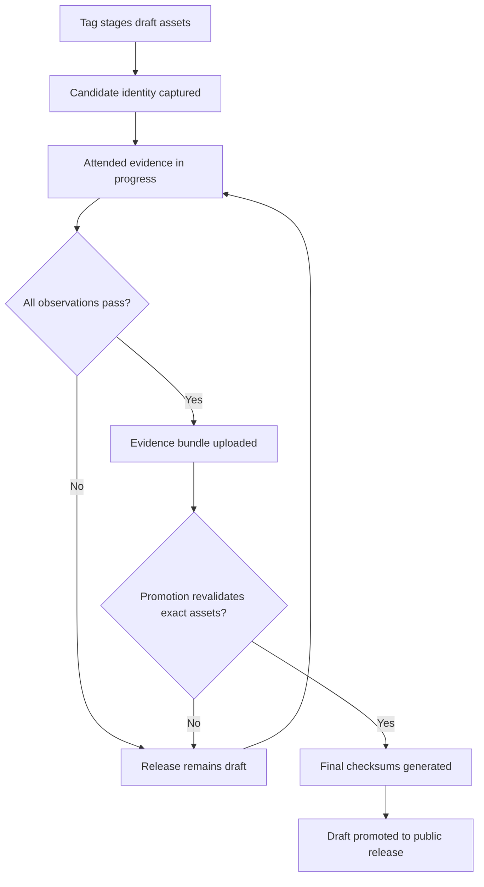

# Data Model: Windows Release Candidate Gate

## Evidence Bundle

The bundle is a directory or ZIP archive with a canonical `evidence.json` at its root and optional attachment files beneath `attachments/`.

```text
evidence-bundle/
├── evidence.json
└── attachments/
    ├── windows/...
    ├── errors/...
    ├── tasks/...
    └── installer/...
```

All text is UTF-8 without BOM. Archive entries use forward-slash relative names, cannot traverse above the root, and cannot use absolute or drive-qualified paths.

## Root Record

| Field | Type | Rule |
| --- | --- | --- |
| `schema_version` | integer | Exactly `1` |
| `evidence_class` | enum | Exactly `attended-windows` for promotion; `automated-fixture` is accepted only through the test-only validator entry point |
| `candidate` | Candidate | Required and exact |
| `operator` | Operator | Required, role-oriented, no secret values |
| `started_at` | RFC 3339 timestamp | Required |
| `completed_at` | RFC 3339 timestamp | Required and not before start |
| `environments` | Environment[] | Unique non-empty IDs; covers required display and account contexts |
| `observations` | Observation[] | Exactly one for every required scenario ID |
| `attachments` | Attachment[] | Unique safe paths with matching bytes and SHA-256 |

Unknown JSON fields are rejected so misspelled security-critical fields cannot be ignored.

## Candidate

| Field | Type | Rule |
| --- | --- | --- |
| `repository` | string | Exactly `shruggietech/go-schedule` for official promotion |
| `tag` | string | `vMAJOR.MINOR.PATCH` |
| `commit` | string | Forty lowercase hexadecimal characters |
| `workflow` | string | Stable release-staging workflow identity |
| `run_id` | integer | Positive GitHub Actions run ID |
| `run_attempt` | integer | Positive attempt number |
| `filename` | string | Canonical Windows MSI asset name for the tag |
| `bytes` | integer | Positive and equal to the candidate artifact |
| `sha256` | string | Sixty-four lowercase hexadecimal characters and equal to the artifact |
| `product_version` | string | Tag without the leading `v` |
| `product_code` | string | Canonical uppercase braced GUID |

## Operator

| Field | Type | Rule |
| --- | --- | --- |
| `role` | string | Non-empty maintainer/operator role; avoid personal name |
| `attested_at` | timestamp | Required |
| `statement` | string | Exact acknowledgement that observations came from the identified candidate and environments |

## Environment

| Field | Type | Rule |
| --- | --- | --- |
| `id` | string | Lowercase stable identifier |
| `snapshot` | string | Non-secret clean-snapshot identifier |
| `clean_snapshot` | boolean | Must be true for required native scenarios |
| `windows_edition` | string | Must identify Windows 11 client, not Server |
| `windows_build` | string | Non-empty build identity |
| `account_role` | enum | `intended-user`, `unrelated-user`, or `administrator` |
| `account_sid` | string | Native process/account SID, without a personal display name |
| `integrity` | enum | `medium`, `high`, or `system` |
| `integrity_rid` | integer | Native mandatory-integrity RID matching `integrity` |
| `service_identity` | string | `LocalSystem` where installed service is observed |
| `display_class` | enum | `standard-dpi`, `high-dpi`, `mixed-dpi`, or `not-applicable` |
| `effective_dpi` | integer | Positive for display environments |
| `profile_state` | enum | `clean`, `retained-v0.9.1`, or `not-applicable` |

At least one clean intended-user environment is standard DPI, one is high or mixed DPI, and one contains retained v0.9.1-era application profile state. Administrator environments may prepare faults but cannot satisfy routine-client observations.

## Observation

| Field | Type | Rule |
| --- | --- | --- |
| `id` | enum | One fixed scenario ID from the contract |
| `environment_id` | string | References one environment |
| `status` | enum | `pass`, `fail`, `unavailable`, `skipped`, `timed-out`, or `partial` |
| `started_at` | timestamp | Required |
| `completed_at` | timestamp | Required and not before start |
| `summary` | string | Concise observed result |
| `metrics` | object | Scenario-specific typed values |
| `attachment_paths` | string[] | At least one attachment for native visual and destructive scenarios |

Promotion accepts only `pass`. The validator does not select a “best” duplicate; duplicate IDs are invalid.

## Required Scenario Families

| Family | Required scenario IDs |
| --- | --- |
| Access | `access.intended-user`, `access.unrelated-user-denied`, `access.fresh-path-resolution`, `access.path-removed` |
| Window | `window.clean-standard`, `window.clean-high-or-mixed`, `window.retained-profile`, `window.state-transitions`, `window.subsequent-launch` |
| Error | `error.daemon-unavailable`, `error.access-denied`, `error.timeout`, `error.stream-disconnect`, `error.repeated-refresh`, `error.manual-retry`, `error.recovery` |
| Tasks | `task.manual-success`, `task.scheduled-success`, `task.nonzero-exit`, `task.start-failure` |
| Setup | `setup.shortcut-defaults`, `setup.shortcut-matrix`, `setup.completion-matrix`, `setup.finish-launch-integrity`, `setup.cancel`, `setup.maintenance`, `setup.upgrade`, `setup.invalid-input`, `setup.rollback` |
| Removal | `remove.preserve`, `remove.wipe`, `remove.cancel`, `remove.multiple-profiles`, `remove.locked-partial`, `remove.reinstall-after-preserve`, `remove.reinstall-after-wipe` |

## Scenario-Specific Metrics

### Window metrics

Required fields: PID, executable SHA-256, HWND, outer rectangle, client rectangle, monitor rectangle, work-area rectangle, logical content width and height, logical work-area width and height, effective DPI, monitor ID, state flags, and positive margins. First-launch scenarios additionally identify requested content dimensions and must satisfy the 1280 by 800 or independent 90-percent rule.

### Error metrics

Repetition-sensitive scenarios record duration seconds (at least 120), sample count, maximum in-frame incident count (exactly one), maximum modal count (zero), maximum additional top-level error-window count (zero), incident category, retry reachability, and whether recovery cleared the incident. Screenshots are mandatory because Fyne canvas overlays do not create distinct HWNDs.

### Task metrics

Success scenarios record public interface, production runner, task ID, run ID, expected and actual exit code, output digest, marker digest, and history result. Failure scenarios record the deliberate trigger and distinct observed diagnostic category. All four observations reference a strict `task-run-evidence-v1` attachment that retains the task definition, output, marker, and history content. Their SHA-256 digests and identities must match the observation metrics.

### Installer/removal metrics

Installer scenarios record selected options, observed process ownership/session/integrity, shortcut or handler targets, and before/after fingerprints. Removal scenarios record mode, populated owned roots, before/after content digests, unaffected controls, profile count, cleanup result, reinstall result, and security-state disposition.

## Attachment

| Field | Type | Rule |
| --- | --- | --- |
| `path` | string | Unique safe relative path below `attachments/` |
| `bytes` | integer | Non-negative and exact |
| `sha256` | string | Lowercase SHA-256 and exact |
| `media_type` | string | Non-empty content type |
| `purpose` | string | Concise non-secret description |

## State Transitions


