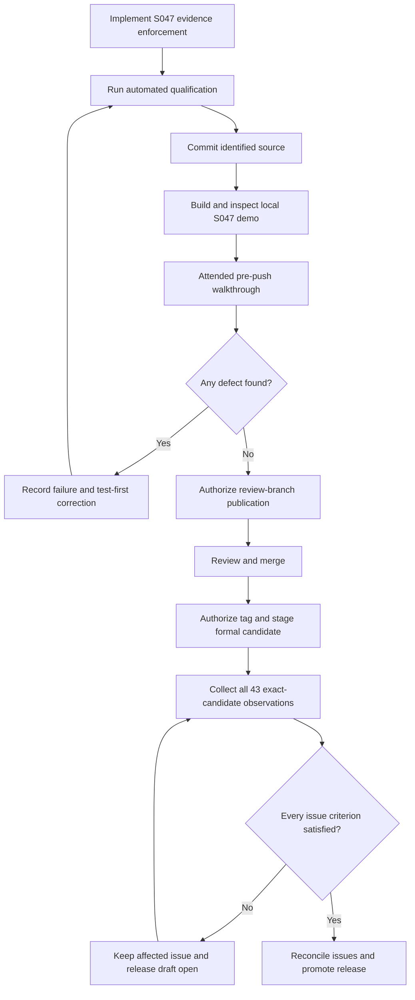

# Data Model: Windows Release Qualification

## RequiredObservation

| Field | Type | Rule |
| --- | --- | --- |
| `id` | stable string | Exactly one canonical scenario identity |
| `issue_refs` | issue number set | Every desktop scenario maps to one or more open v1 issues |
| `environment` | reference | Existing unique Windows environment identity |
| `status` | enum | Only `pass` satisfies release readiness |
| `metrics` | typed map | Scenario-specific complete evidence |
| `attachment_paths` | string set | At least one hashed native image for `desktop.*` |

The seven S047 identities extend, but never replace, the 36 S040 identities.
The final bundle therefore contains exactly 43 observations.

## DesktopQualificationMetrics

### Shared invariants

- intended-user account at medium integrity;
- installed service identity `LocalSystem`;
- Windows 11 client environment;
- one or more referenced image attachments;
- explicit boolean results are true unless the field documents an allowed
  negative state such as `horizontal_scrollbar_present: false`;
- exact-set fields contain trimmed, unique values with no omissions or extras.

### `desktop.appearance-standard`

| Metric | Rule |
| --- | --- |
| `palettes` | Exact set `dark,light` |
| `effective_dpi` | Exactly 96 and equal to environment |
| `system_font_default`, `system_font_restored`, `font_persistence_verified` | True |
| `info_text_sharp`, `body_text_sharp`, `labels_centered`, `labels_unclipped` | True |
| `resize_verified`, `minimize_restore_verified`, `reopen_verified` | True |
| `fonts_exercised` | Exact set `system,geist,inter,ubuntu,monospace` |

### `desktop.appearance-scaled`

Same appearance fields, except `effective_dpi` is greater than 96 and equals
the environment's native value.

### `desktop.interaction-states`

| Metric | Rule |
| --- | --- |
| `palettes` | Exact set `dark,light` |
| `control_families` | Exact set `navigation,selector,ordinary,primary,danger,dialog,table-row` |
| `states` | Exact set `rest,hover,focus,pressed,selected,disabled` |
| `minimum_text_contrast` | At least 4.5 |
| `minimum_non_text_contrast` | At least 3.0 |
| `labels_readable`, `glyphs_readable`, `selection_identifiable`, `focus_visible`, `non_color_cues_present` | True |

### `desktop.navigation-options`

| Metric | Rule |
| --- | --- |
| `palettes` | Exact set `dark,light` |
| `content_sizes` | Exact set `1280x800,800x600` |
| `destination_order` | Exact string `tasks,groups,chains,schedule,activity,options,info` |
| `rail_spacing_balanced`, `labels_unclipped`, `boundary_full_height`, `boundary_subtle` | True |
| `exit_bottom_right`, `exit_never_selected`, `exit_semantic_glyph` | True |
| `storage_rows_compact`, `unavailable_rows_muted`, `copy_exact`, `selector_current_omitted` | True |
| `horizontal_scrollbar_present` | False |

### `desktop.scroll-input`

| Metric | Rule |
| --- | --- |
| `sensitivities` | Exact set `1x,2x,4x` |
| `surfaces` | Exact set `options,info,editor-command,editor-schedule,editor-help` |
| `wheel_detents_responsive`, `immediate_apply`, `persistence_verified`, `nested_multiplier_absent`, `keyboard_scroll_preserved` | True |
| `touchpad_available` | Boolean |
| `touchpad_fine_deltas_preserved` | True when available |
| `touchpad_unavailable_reason` | Non-empty when unavailable |

### `desktop.tasks-table`

| Metric | Rule |
| --- | --- |
| `row_count` | At least 100 |
| `palettes` | Exact set `dark,light` |
| `content_sizes` | Exact set `1280x800,800x600` |
| `headers` | Exact set `task,enabled,lifecycle,time-zone,group` |
| `row_states` | Exact set `odd,even,hover,focus,selected` |
| `headers_frozen`, `status_dimensions_distinct`, `bracket_decoration_absent`, `full_values_discoverable` | True |
| `horizontal_scrollbar_present` | False |
| `refresh_identity_stable`, `removed_selection_clears`, `toolbar_actions_work`, `double_click_edits` | True |

### `desktop.schedule-activity-tables`

| Metric | Rule |
| --- | --- |
| `schedule_row_count`, `activity_row_count` | Each at least 100 |
| `palettes` | Exact set `dark,light` |
| `content_sizes` | Exact set `1280x800,800x600` |
| `schedule_headers` | Exact set `when,task,event,outcome` |
| `activity_headers` | Exact set `when,severity,source,summary` |
| `schedule_states` | Exact set `scheduled,success,failure,skipped,caught-up,queued,missing,unknown` |
| `severities` | Exact set `INFO,WARNING,ERROR` |
| `row_states` | Exact set `odd,even,hover,focus,selected` |
| header, semantic, disclosure, interaction, and refresh outcome booleans | True |
| `horizontal_scrollbar_present` | False |

## LocalDemo

| Field | Rule |
| --- | --- |
| `slice` | `S047` |
| `class` | `local-demo` |
| `source_commit` | Full committed Git identity |
| `embedded_version` | `1.0.0-s047-demo.<short-commit>` |
| `product_version` | `1.0.0` |
| `product_code` | Compiled canonical GUID |
| `filename` | Contains `s047-demo` and platform/architecture |
| `bytes`, `sha256`, `built_at` | Exact artifact identity |
| `inspection` | Passing compiled-MSI report |

Any byte change creates a new LocalDemo. It never transitions into the formal
candidate and its observations cannot be copied as formal pass results.

## IssueDisposition

| Issue | Formal evidence mapping |
| --- | --- |
| #101 | both appearance observations |
| #104 | navigation/options plus interaction states |
| #105 | navigation/options plus interaction states |
| #106 | both appearance observations, navigation/options, scroll input |
| #109 | interaction states plus both table observations |
| #111 | scroll input |
| #112 | Tasks table plus interaction states |
| #113 | Schedule/Activity tables plus interaction states |
| #98 | existing setup/removal observations |
| #96 | aggregate child and release-readiness reconciliation |

State is `open`, `eligible-to-close`, or `closed`. Only reviewed formal
candidate evidence can move an issue requiring that evidence to
`eligible-to-close`; S047 does not rewrite historical GitHub state.

## Qualification Flow

