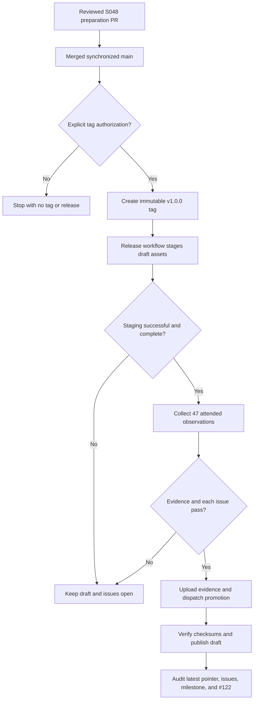

# Data Model: v1.0.0 Release Cut

## ReleasePreparation

| Field | Rule |
| --- | --- |
| `version` | Exactly `v1.0.0` |
| `prior_version` | Exactly `v0.9.1` |
| `release_date` | Local calendar date of the reviewed changelog cut |
| `baseline_commit` | S047 merge commit `d4ad27540331eae943e43a3830d4f5c9a6c38afa` |
| `unreleased_entry_count` | 33 before the cut |
| `unreleased_sha256` | Normalized pre-cut section digest recorded in verification |
| `readme_badge_count` | Exactly one and derives from the latest published GitHub release |
| `readme_health_count` | Exactly one and identifies 1.0.0 |
| `release_note_bullets` | Four through six; S048 uses five |
| `release_note_links` | Exactly one tagged changelog link |

## StagedCandidate

| Field | Rule |
| --- | --- |
| `tag` | `v1.0.0` |
| `commit` | Reviewed S048 merge commit, identical to synchronized `main` |
| `workflow` | `Release` |
| `run_id`, `run_attempt` | Positive and identify one successful staging attempt |
| `filename` | `go-schedule_v1.0.0_windows_amd64.msi` |
| `product_version` | `1.0.0` |
| `product_code` | Canonical compiled MSI GUID |
| `bytes`, `sha256` | Exact staged MSI identity |
| `release_state` | Draft until promotion succeeds |

## ExpectedAsset

The draft contains exactly these nine payloads before promotion adds checksums:

1. `go-schedule_v1.0.0_darwin_amd64.tar.gz`
2. `go-schedule_v1.0.0_darwin_arm64.tar.gz`
3. `go-schedule_v1.0.0_linux_amd64.tar.gz`
4. `go-schedule_v1.0.0_linux_arm64.tar.gz`
5. `go-schedule-desktop_v1.0.0_darwin_arm64.tar.gz`
6. `go-schedule-desktop_v1.0.0_linux_amd64.tar.gz`
7. `go-schedule_v1.0.0_windows_amd64.msi`
8. `windows-candidate-manifest.json`
9. `go-schedule_v1.0.0_windows-attended-evidence.zip`

Promotion adds `SHA256SUMS.txt`, with exactly one digest for each of the nine payloads.

## FormalEvidenceBundle

| Field | Rule |
| --- | --- |
| `evidence_class` | `attended-windows` |
| `candidate` | Exact equality with StagedCandidate and downloaded manifest |
| `operator` | Attested release maintainer within the evidence interval |
| `environments` | Clean Windows 11 client contexts required by S040/S047 |
| `observations` | Exactly 47 unique required IDs, all `pass` |
| `attachments` | Safe relative paths, regular files, exact bytes/SHA-256; required screenshots contain supported raster signatures |

## IssueDisposition

| Issue | Required formal evidence |
| --- | --- |
| #98 | setup/removal matrix, including preserve, wipe, cancel, profiles, locked partial cleanup, and reinstall outcomes |
| #101 | standard/scaled appearance |
| #104 | standard/scaled navigation/options and interaction states |
| #105 | standard/scaled navigation/options and interaction states |
| #106 | standard/scaled appearance and navigation/options plus scroll input |
| #109 | standard/scaled interaction states plus table consumers |
| #111 | physical scroll input |
| #112 | standard/scaled Tasks table plus interaction states |
| #113 | standard/scaled Schedule/Activity tables plus interaction states |
| #96 | all child and coordinator completion criteria after individual reconciliation |

State is `open`, `evidence-passing`, or `closed`. A shared passing observation does not bypass issue-specific criteria.

## ReleaseState

