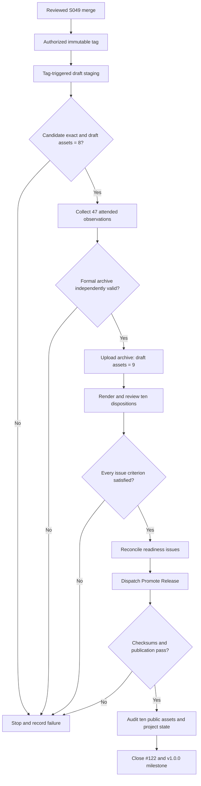

# Data Model: v1.0.0 Release Execution and Audit

## ReleaseIdentity

| Field | Rule |
| --- | --- |
| Repository | Exactly `shruggietech/go-schedule` |
| Tag | Exactly `v1.0.0`; annotated and immutable |
| Tag object | One remote annotated tag object |
| Peeled commit | Exactly `ff47b4410d1aecbfadb8165d1ebf025ca1dadde7` |
| Workflow | Exactly `Release` from `.github/workflows/release.yml` |
| Event | Exactly `push` |
| Run | Exactly one accepted successful run, with positive run and attempt IDs |
| Release | One draft during qualification, then the same release becomes public |

## CandidateManifest

| Field | Validation |
| --- | --- |
| Repository, tag, commit | Equal ReleaseIdentity |
| Workflow, run, attempt | Equal the accepted staging run |
| MSI filename | `go-schedule_v1.0.0_windows_amd64.msi` |
| MSI bytes and SHA-256 | Equal independently downloaded artifact |
| ProductVersion | Exactly `1.0.0` |
| ProductCode | Valid compiled MSI product identity and equal installed product |

## FormalEvidence

| Field | Rule |
| --- | --- |
| Class | `formal` attended evidence only |
| Candidate | Equal CandidateManifest and exact MSI |
| Environments | Genuine required Windows accounts, integrity levels, displays, and lifecycle states |
| Observations | Exactly 47 canonical unique identifiers |
| Status | Every observation is `pass` |
| Metrics | Complete typed fields and exact expected sets per scenario |
| Attachments | All required paths exist beneath the archive root and contain supported non-empty bytes |
| Archive | Finalized once under the canonical v1.0.0 filename and independently verified |

## IssueDisposition

| Field | Rule |
| --- | --- |
| Issue set | #96, #98, #101, #104, #105, #106, #109, #111, #112, #113 |
| Mapping | Exact S049 observation mapping |
| Candidate identity | Equal FormalEvidence candidate |
| Acceptance review | Mapped observations plus every issue-specific criterion |
| State | `blocked`, `eligible`, or `closed` |
| Coordinator roles | #96 children and prerequisites remain explicitly distinguished |

## PublishedAssetSet

Before promotion the draft has exactly nine payloads: seven platform packages,
`windows-candidate-manifest.json`, and the formal evidence ZIP. Promotion adds
`SHA256SUMS.txt`, yielding exactly ten public assets.

Every checksum line maps to exactly one non-checksum payload. Asset names are
unique, all bytes are non-empty, and the public bytes equal the qualified draft
bytes.

## ReleaseAudit

| Field group | Contents |
| --- | --- |
| Authorization | User instruction and timestamp context, without invented approver metadata |
| Tag | Local/remote object and peeled commit |
| Staging | Run ID, attempt, jobs, conclusion, draft release ID and URL |
| Candidate | Manifest and MSI names, sizes, hashes, product identity |
| Evidence | Archive name, size, hash, 47/47 status, environment and attachment counts |
| Issues | Per-issue disposition file hash, evidence comment URL, final state |
| Promotion | Workflow run, conclusion, unchanged release ID, publication timestamp |
| Public audit | Exact ten-asset inventory, checksum result, latest pointer, notes/docs identity |
| Project state | #96, #122, readiness issues, milestone, branch and repository state |

## State Transitions

