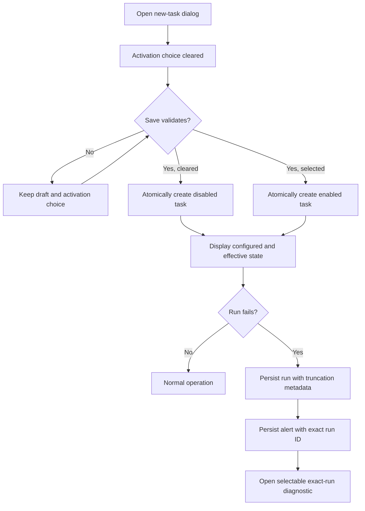

# Data Model: Task Execution Safety and Diagnostics

## TaskCreateIntent

| Field | Type | Rules |
| --- | --- | --- |
| Enabled | optional boolean | Omitted preserves the existing active default; explicit false creates the task disabled; explicit true creates it enabled |

The intent exists only at the create boundary. The persisted `Task.Enabled`
boolean remains authoritative after creation, and edit requests do not inherit
or synthesize this creation-only intent.

## EffectiveTaskState

| Field | Source | Rules |
| --- | --- | --- |
| ConfiguredEnabled | `Task.Enabled` | Shown independently as Enabled or Disabled |
| Lifecycle | `Task.State` | Active is required for scheduling eligibility |
| Runnable | derived | True only when configured enabled, lifecycle active, and group chain enabled |
| Reason | derived | Runnable, Task disabled, lifecycle explanation, Blocked by nearest disabled group, or Group chain unavailable |
| BlockingGroupID | derived group chain | Present only for an explicit disabled group |
| BlockingGroupName | derived group chain | Full path label when resolvable |

### Precedence

1. A configured-disabled task reports `Task disabled`.
2. A non-active lifecycle reports its normalized lifecycle reason.
3. A disabled direct/ancestor group reports the nearest disabled group.
4. A group chain rejected for a non-named reason (such as a cycle) reports
   `Group chain unavailable`.
5. Otherwise the task reports `Runnable`.

No effective-state value is persisted. It is recomputed from each live task and
group snapshot.

## Run

Existing fields remain unchanged. S051 adds:

| Field | Type | Default | Rules |
| --- | --- | --- | --- |
| OutputTruncated | boolean | false | True only when one or more process-output bytes were discarded after reaching the configured capture cap |

The `Output` string never exceeds the configured cap. `OutputTruncated` is
metadata and does not consume or replace captured bytes.

## Alert

Existing fields remain unchanged. S051 adds:

| Field | Type | Default | Rules |
| --- | --- | --- | --- |
| RunID | optional string | empty | Populated for newly created `run_failed` alerts with the exact persisted run ID; empty for other and legacy alerts |

`RunID` deliberately remains a durable identifier if its run is later removed.
An absent referenced run produces an unavailable diagnostic, never a substitute.

## FailedRunDiagnostic

| Field | Source | Fallback |
| --- | --- | --- |
| Alert identity/time/severity | Alert | Always available |
| Task ID | Alert | `Unavailable` for legacy records |
| Task name | Exact task lookup | `Unavailable (task may have been deleted)` |
| Run ID | Alert | `Unavailable (legacy alert)` |
| Trigger/outcome | Exact run lookup | `Unavailable` with lookup reason |
| Exit status | Exact run | Numeric exit code, or `Process did not produce an exit status` |
| Combined output | Exact run | `(empty)` or unavailable reason |
| Truncation | Exact run | `Yes` or `No` |

The diagnostic never includes task arguments, standard input, environment
values, or any reconstruction of the command line.

## Migration v10

```text
runs.output_truncated INTEGER NOT NULL DEFAULT 0
alerts.run_id TEXT
```

The migration is additive and transactional. Existing runs become not
truncated; existing alerts remain uncorrelated. Failure rolls back both schema
changes and leaves the recorded schema version at 9.

## State Transitions


