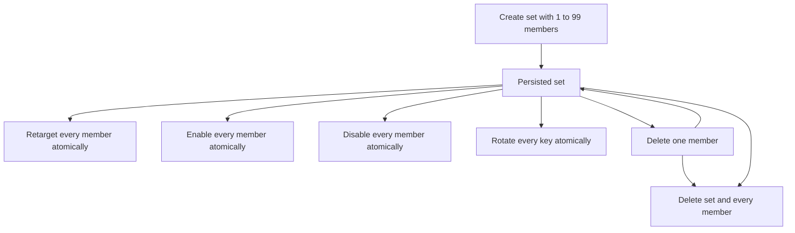

# Data Model: Trigger Sets

## Trigger Set

| Field | Meaning | Rules |
| --- | --- | --- |
| ID | Stable set identity | Required and immutable |
| Name | Operator-facing label | Trimmed, nonblank, duplicates allowed |
| Target task ID | Shared task target | Required existing task; immutable only through atomic retarget |
| Created at | Creation time | UTC RFC 3339 |
| Updated at | Last set-level mutation time | UTC RFC 3339 |

A Trigger Set owns 1 through 99 member triggers. Deleting its target task cascades to the set and members.

## External Trigger Membership Extension

| Field | Meaning | Rules |
| --- | --- | --- |
| Set ID | Optional owning Trigger Set | Null for standalone triggers; immutable after creation |
| Set position | Permanent creation ordinal | Null for standalone triggers; 1 through 99 and unique within a set |
| Set name | Joined display metadata | Derived, never stored on the trigger row |

Every member remains an ordinary external trigger with the S054 key, enabled state, readiness, timestamps, firing, and provenance contracts. Deleting a nonfinal member leaves sibling positions unchanged. Deleting the final member also deletes the set atomically.

## Bulk Secret Result

| Field | Meaning | Rules |
| --- | --- | --- |
| Set | Redacted Trigger Set identity and current state | Required |
| Members | Ordered secret-bearing member results | Ascending permanent position |
| Position | Stable member position | Required |
| Trigger ID | Stable trigger identity | Required |
| Key | Raw trigger key | Present only in create, explicit reveal, or rotate results |
| Command | Complete invocation command | Exactly `gosched trigger fire <key>` |

## State Transitions

## Migration

Schema version 13 creates the Trigger Set table, adds nullable membership fields to external triggers, and creates target and unique-position indexes. Existing version 12 trigger rows receive null membership and retain every original field and behavior.
