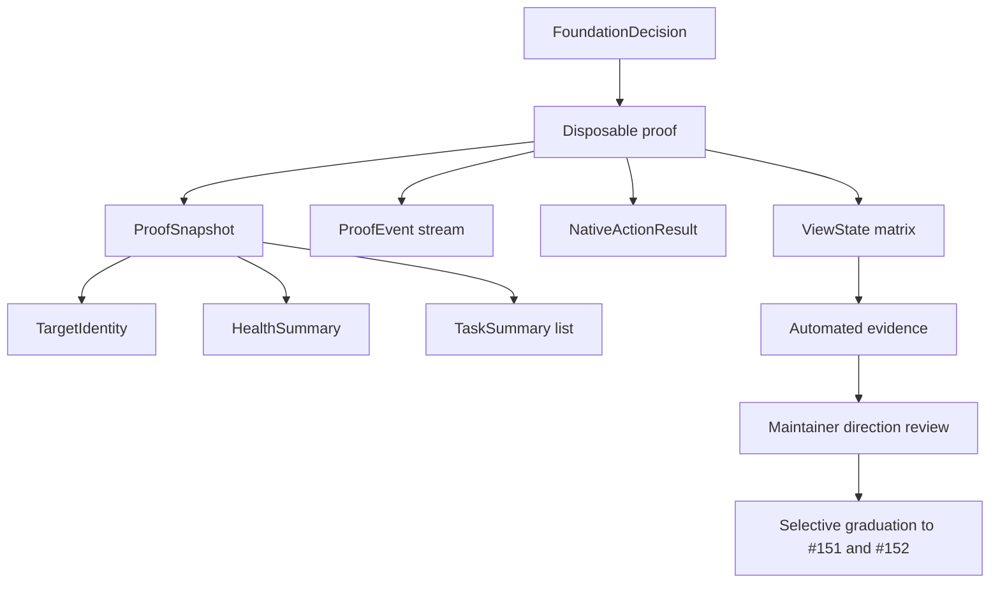

# Data Model: Wails Foundation and Experience Direction

S060 adds no persisted product data. These bounded proof models define the evidence and typed frontend boundary that later slices may adopt deliberately.

## FoundationDecision

| Field | Type | Validation |
| --- | --- | --- |
| wailsVersion | semantic version | Exact stable release, no range or prerelease |
| frontend | StackBaseline | Every tool has an exact direct version and license |
| nodeVersion | major LTS line | Active or Maintenance LTS on decision date |
| platformPrerequisites | map of platform to list | Windows, macOS, and Linux all present |
| upgradePolicy | text | Stable-only default and proof rerun requirement |
| rejectedAlternatives | list of Alternative | At least Wails v3 prerelease, Electron, and bounded frontend candidates |

## ProofSnapshot

| Field | Type | Validation |
| --- | --- | --- |
| target | TargetIdentity | Always present |
| health | HealthSummary | One of connected, disconnected, degraded, or loading |
| tasks | list of TaskSummary | Stable IDs, names, state, schedule, next run, and last result |
| generatedAt | RFC 3339 timestamp | UTC at boundary |

## TargetIdentity

| Field | Type | Validation |
| --- | --- | --- |
| id | string | Stable nonempty proof identifier |
| displayName | string | `This computer` for local proof |
| platform | enum | windows, macos, or linux |
| connection | enum | connected, disconnected, degraded, loading |
| detail | string | Actionable status detail, no secret or endpoint value |

## HealthSummary

| Field | Type | Validation |
| --- | --- | --- |
| status | enum | connected, disconnected, degraded, loading |
| version | string | Empty only when not connected |
| message | string | Plain-language state and recovery guidance |

## TaskSummary

| Field | Type | Validation |
| --- | --- | --- |
| id | string | Stable nonempty identity |
| name | string | Nonempty display name |
| enabled | boolean | Explicit, never inferred from status text |
| schedule | string | Human-readable representative value |
| nextRun | string | RFC 3339 or empty when unavailable |
| lastResult | enum | success, failed, running, never, or unavailable |

## ProofEvent

| Field | Type | Validation |
| --- | --- | --- |
| id | string | Stable event identity |
| kind | string | Bounded proof event name |
| message | string | Plain, non-sensitive description |
| occurredAt | RFC 3339 timestamp | UTC |
| taskId | optional string | References TaskSummary when relevant |

## NativeActionResult

| Field | Type | Validation |
| --- | --- | --- |
| action | enum | about-dialog |
| outcome | enum | shown, cancelled, unavailable, failed |
| message | string | Actionable and safe for display |

## ViewState

| Field | Type | Validation |
| --- | --- | --- |
| page | enum | tasks, task-editor, schedule, activity, targets, compact |
| condition | enum | new, empty, loading, connected, disconnected, degraded, destructive, validation-error, success |
| appearance | enum | system, light, dark |
| compact | boolean | True at or below the contract breakpoint |

## Relationships and lifecycle

The application context owns the event-stream lifecycle. Startup creates at most one stream; shutdown cancels it and waits for termination. Snapshot failures produce a bounded disconnected or degraded model rather than exposing transport details to the frontend. No proof entity is written to the scheduler store.
