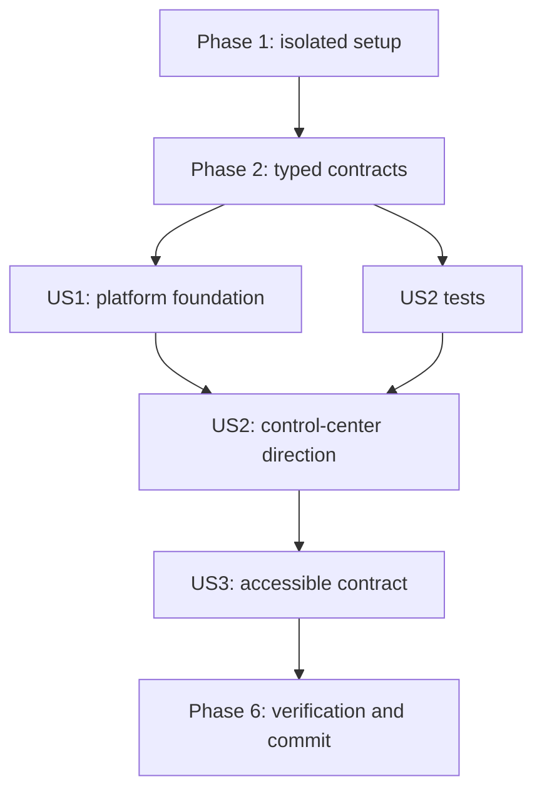

# Tasks: Wails Foundation and Experience Direction

**Input**: Design documents from `/specs/060-wails-foundation-direction/`

**Tests**: Required by the specification, both bundled GitHub issues, and constitution principle II. Boundary, component, accessibility, browser, workflow-contract, and cross-platform build evidence precedes completion.

**Organization**: Tasks are grouped by independently reviewable user story and execute chronologically under one-agent autopilot.

## Phase 1: Setup

**Purpose**: Establish the isolated proof and exact dependency boundaries without changing production packaging.

- [x] T001 Create the nested proof module and Wails application manifests in `experiments/wails-foundation/go.mod`, `experiments/wails-foundation/wails.json`, and `experiments/wails-foundation/frontend/package.json`
- [x] T002 [P] Add proof-specific build-output and dependency exclusions to `.gitignore`
- [x] T003 [P] Register byte-identical proof font and icon consumers in `brand/repository-consumers.json` and stage approved assets under `experiments/wails-foundation/frontend/public/fonts/` and `experiments/wails-foundation/build/`
- [x] T004 Record the proof purpose, prerequisites, boundaries, selected stack, license inventory, and graduation ledger in `experiments/wails-foundation/README.md`

---

## Phase 2: Foundational Contracts

**Purpose**: Define shared typed state and deterministic seams before either user story is implemented.

- [x] T005 Add typed proof snapshot, target, health, task, event, and native-result models in `experiments/wails-foundation/app.go`
- [x] T006 Define injectable daemon, event, and native-action interfaces with cancelable ownership in `experiments/wails-foundation/app.go`
- [x] T007 [P] Define matching frontend bridge types, representative fixtures, and Wails-or-preview adapter behavior in `experiments/wails-foundation/frontend/src/proof.ts`
- [x] T008 [P] Configure strict TypeScript, Vite, Vitest, jsdom, axe, and Playwright in `experiments/wails-foundation/frontend/tsconfig.json`, `experiments/wails-foundation/frontend/vite.config.ts`, and `experiments/wails-foundation/frontend/playwright.config.ts`

**Checkpoint**: Boundary types and test harnesses exist with no production integration.

---

## Phase 3: User Story 1 - Choose a Supportable Desktop Foundation (Priority: P1)

**Goal**: Prove the selected Wails foundation against the real local API boundary and every supported desktop build.

**Independent Test**: Run nested Go race tests, frontend tests and build, then the hosted Wails build matrix; health, list, event, native action, offline assets, and clean shutdown all have evidence.

### Tests for User Story 1

- [x] T009 [P] [US1] Write failing Go tests for connected health and task-list snapshot mapping in `experiments/wails-foundation/app_test.go`
- [x] T010 [P] [US1] Write failing Go tests for disconnected mapping, event conversion, native action results, duplicate-start prevention, cancellation, and shutdown in `experiments/wails-foundation/app_test.go`
- [x] T011 [P] [US1] Add failing frontend bridge and offline-asset contract tests in `experiments/wails-foundation/frontend/src/proof.test.ts`
- [x] T012 [P] [US1] Add failing workflow-policy fixtures for the Node action and three-platform proof job in `test/scripts/automation-check_test.sh`

### Implementation for User Story 1

- [x] T013 [US1] Implement snapshot mapping, safe errors, event conversion, native action dispatch, and cancelable lifecycle in `experiments/wails-foundation/app.go`
- [x] T014 [US1] Wire the real protected local IPC client and Wails dialog/event runtime in `experiments/wails-foundation/main.go`
- [x] T015 [US1] Implement the typed Wails-or-preview frontend adapter with no runtime network assets in `experiments/wails-foundation/frontend/src/proof.ts`
- [x] T016 [US1] Add `actions/setup-node@v7` to the approved action policy in `scripts/automation-check.sh`
- [x] T017 [US1] Add the Windows, macOS, and Linux Wails proof matrix plus Ubuntu browser contract job to `.github/workflows/ci.yml`

**Checkpoint**: The selected stack is reproducible, isolated, and buildable on every target platform.

---

## Phase 4: User Story 2 - See One Fresh Control-Center Direction (Priority: P1)

**Goal**: Deliver one concrete target-aware prototype covering the representative views and operating states.

**Independent Test**: Run component and browser suites, inspect all six views at both contract widths, and answer the five hierarchy questions within 10 seconds per view.

### Tests for User Story 2

- [x] T018 [P] [US2] Write failing component tests for landmarks, target identity, page hierarchy, navigation, state coverage, and single-primary-action behavior in `experiments/wails-foundation/frontend/src/App.test.tsx`
- [x] T019 [P] [US2] Write failing browser tests for six views, compact reflow, no horizontal overflow, target persistence, and representative screenshots in `experiments/wails-foundation/frontend/e2e/experience.spec.ts`

### Implementation for User Story 2

- [x] T020 [US2] Implement the application rail, target bar, page header, state toolbar, Tasks, task editor, Schedule, Activity, target switcher, and inspector in `experiments/wails-foundation/frontend/src/App.tsx`
- [x] T021 [US2] Implement the brand-derived dark, light, system, compact, disconnected, degraded, destructive, validation, loading, empty, and success presentation in `experiments/wails-foundation/frontend/src/styles.css`
- [x] T022 [US2] Add the Vite entry point and local document shell in `experiments/wails-foundation/frontend/index.html` and `experiments/wails-foundation/frontend/src/main.tsx`

**Checkpoint**: The prototype is visibly distinct from Fyne and makes target, status, and next action obvious.

---

## Phase 5: User Story 3 - Inherit a Measurable Accessible Design Contract (Priority: P2)

**Goal**: Make the direction reusable and objectively reviewable by later migration slices.

**Independent Test**: Run axe, keyboard, zoom, contrast, reduced-motion, and token checks and trace every shared pattern to the experience contract or graduation ledger.

### Tests for User Story 3

- [x] T023 [P] [US3] Write failing component accessibility tests for axe, names, landmarks, status announcements, dialog focus return, and keyboard navigation in `experiments/wails-foundation/frontend/src/accessibility.test.tsx`
- [x] T024 [P] [US3] Write failing browser checks for keyboard-only operation, Escape dismissal, 200 percent zoom, focus visibility, target sizing, light and dark contrast, and reduced motion in `experiments/wails-foundation/frontend/e2e/accessibility.spec.ts`
- [x] T025 [P] [US3] Add failing token and asset-consistency tests in `experiments/wails-foundation/frontend/src/tokens.test.ts`

### Implementation for User Story 3

- [x] T026 [US3] Implement semantic dialog, disclosure, status, table, form, empty-state, error, and confirmation primitives in `experiments/wails-foundation/frontend/src/App.tsx`
- [x] T027 [US3] Complete focus, target-size, contrast, zoom, reduced-motion, and token behavior in `experiments/wails-foundation/frontend/src/styles.css`
- [x] T028 [US3] Synchronize final measurable rules and proof-to-production dispositions across `specs/060-wails-foundation-direction/contracts/experience-contract.md`, `specs/060-wails-foundation-direction/contracts/foundation-contract.md`, and `experiments/wails-foundation/README.md`

**Checkpoint**: #151 and #152 inherit explicit contracts rather than subjective screenshots or prototype shortcuts.

---

## Phase 6: Polish and Cross-Cutting Concerns

- [x] T029 Generate exact Go and npm lock data, audit direct dependency licenses, and verify no runtime URL or release-path coupling in `experiments/wails-foundation/go.sum`, `experiments/wails-foundation/frontend/package-lock.json`, and `experiments/wails-foundation/README.md`
- [x] T030 Update `[Unreleased]` architecture and experience entries plus dated decisions in `CHANGELOG.md`
- [x] T031 Advance S060 to `In Progress`, then `Implemented` with delivery evidence in `specs/060-wails-foundation-direction/spec.md` and `specs/README.md`
- [x] T032 Run focused Go race, frontend, browser, brand, workflow-policy, lifecycle, encoding, mojibake, and diff-integrity checks and record results in `specs/060-wails-foundation-direction/verification.md`
- [x] T033 Run the canonical eight-gate verification command in the foreground and record all gate and coverage results in `specs/060-wails-foundation-direction/verification.md`
- [x] T034 Audit #149 and #150 acceptance traceability, resolve every task, and commit as `feat(060): prove Wails foundation and direction` with the required co-author trailer

---

## Dependencies and Execution Order

- Setup and foundational contracts block all stories.
- US1 proves the runtime and bridge used by the prototype.
- US2 can define failing experience tests after foundation types exist, but implementation follows the working bridge.
- US3 builds on the concrete views and makes their rules reusable.
- Polish runs only after all story checkpoints pass.

## Parallel Opportunities

- T002, T003, and T004 touch independent setup surfaces after T001.
- T007 and T008 can proceed beside the Go boundary tasks.
- T009 through T012 are independent failing-test surfaces.
- T018 and T019 cover component and browser layers independently.
- T023 through T025 cover separate accessibility, browser, and token contracts.

## Implementation Strategy

The minimum useful increment is US1: a stable, real-boundary, cross-platform foundation decision. S060 deliberately continues through US2 and US3 because issue #150 can proceed alongside #149 and because the shell issue should not start without a selected experience contract. The slice publishes one coherent review artifact while preserving separate issue traceability and leaving production migration work open.

## Completion Boundary

All 34 implementation and verification tasks must be checked. Push, pull-request creation, hosted review, merge, and cleanup are publication evidence and do not appear as implementation tasks. The operator's explicit kickoff authorizes this review branch, its pull request, and verified in-scope fixes through at most two Codex review rounds; merge remains the maintainer's decision.
