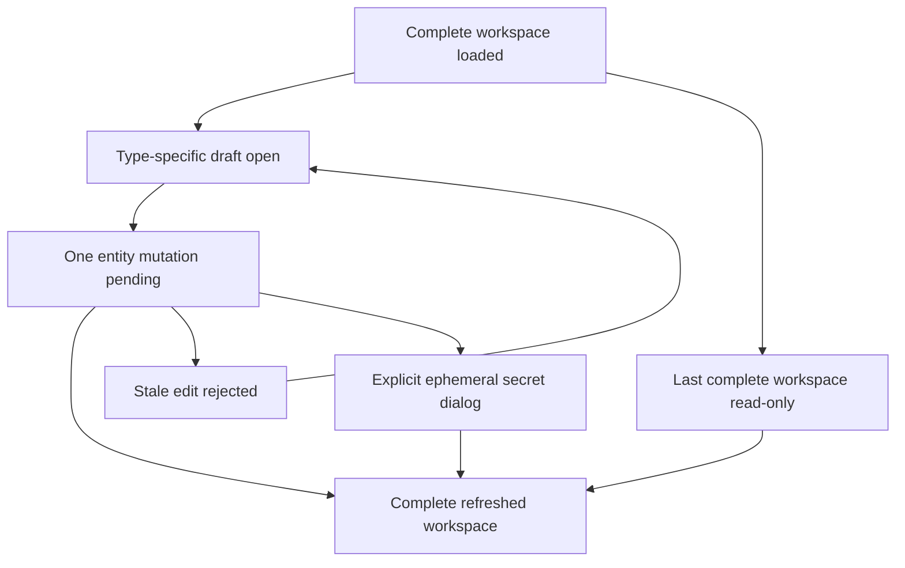

# Data Model: Connected Automation Sources

## AutomationWorkspace

- `tasks`: stable task identifiers and display names for source and target selection
- `chains`: completion-chain summaries
- `triggers`: standalone external-trigger summaries only; Trigger Set members are represented by their set
- `triggerSets`: ordered Trigger Set summaries and member metadata without keys
- `watchers`: filesystem-watcher summaries with daemon health
- `loadedAt`: UTC timestamp for the complete snapshot

Invariant: no raw trigger key or fire command appears anywhere in this entity graph.

## TaskChoice

- `id`
- `name`
- `readiness`
- `reason`

## CompletionChainSummary and ChainDraft

- Summary: `id`, `sourceTaskId`, `sourceTaskName`, `targetTaskId`, `targetTaskName`, `onOutcome`, `readiness`, `reason`, `updatedAt`
- Draft: summary identity fields plus `isNew`, `originalUpdatedAt`, `overwriteStale`
- Validation: source and target are required and distinct; outcome is `success`, `failure`, or `any`; server cycle validation remains authoritative

## TriggerSummary and TriggerDraft

- Summary: `id`, `name`, `targetTaskId`, `targetTaskName`, `enabled`, `readiness`, `reason`, `updatedAt`
- Draft: editable summary fields plus `isNew`, `originalUpdatedAt`, `overwriteStale`
- Validation: name and target are required
- Invariant: standalone collection excludes members whose `setId` is populated

## TriggerSetSummary and TriggerSetDraft

- Summary: `id`, `name`, `targetTaskId`, `targetTaskName`, `memberCount`, `enabledCount`, ordered `members`, `readiness`, `reason`, `updatedAt`
- Draft: `id`, `name`, `targetTaskId`, `count`, `enabled`, `isNew`, `originalUpdatedAt`, `overwriteStale`
- Validation: new sets require name, target, and a bounded positive count; existing sets support atomic retarget and toggle operations rather than member-by-member edits

## WatcherSummary and WatcherDraft

- Summary: `id`, `name`, `kind`, `path`, `pattern`, `recursive`, `debounce`, `stability`, `targetTaskId`, `targetTaskName`, `enabled`, `health`, `healthReason`, `readiness`, `reason`, `updatedAt`
- Draft: editable summary fields plus `isNew`, `originalUpdatedAt`, `overwriteStale`
- Validation: name, kind, path, target, and positive duration syntax are required; pattern is required only for glob selection
- Invariant: health and health reason are copied from the daemon response and never synthesized from enabled state

## SecretResult

- `action`, `outcome`, `message`, `entityId`
- `title`
- ordered `secrets`: each contains a label, raw `key`, and executable `command`

Invariant: returned only by create, reveal, and rotate methods. It is never attached to `AutomationWorkspace` or emitted as an event.

## OperationResult

- `action`
- `outcome`: `accepted`, `rejected`, `stale`, or `unavailable`
- `message`
- optional `field`, `entityId`, `workspace`

## State Transitions

