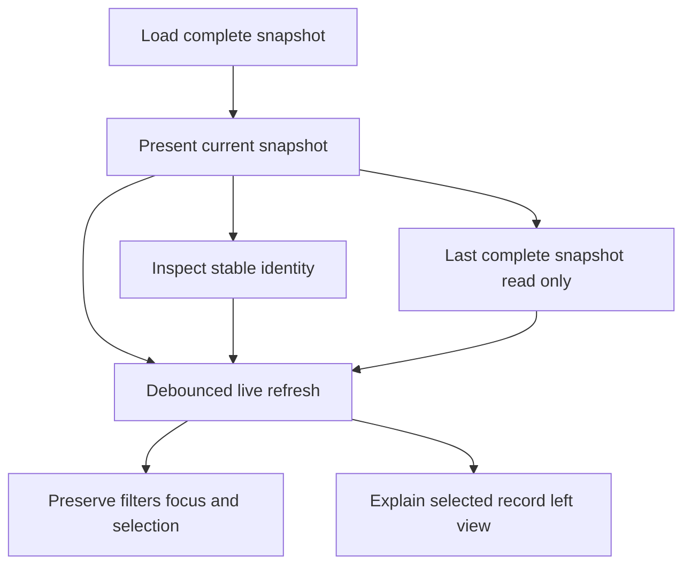

# Data Model: Operational Schedule and Activity

## ScheduleSnapshot

- `from`, `to`, `loadedAt`
- `occurrences`: complete ordered ScheduleOccurrence collection

Invariant: the requested window is explicit and every occurrence retains its source kind.

## ScheduleOccurrence

- `id`: stable presentation identity
- `taskId`, `taskName`
- `runId` when the occurrence is backed by a persisted run
- `time`
- `kind`: `prediction` or `recorded`
- `state`: `upcoming`, `running`, `success`, `failure`, `skipped`, `caught_up`, `queued`, or `unavailable`
- `outcome` when available

Invariant: predictions have no run identity and never claim a recorded outcome.

## ActivityWorkspace

- `runs`: authoritative active executions followed by recent persisted run records, with one stable identity spanning active and completed states
- `logs`: recent daemon log records
- `alerts`: scheduler alerts
- `logPath`: exact daemon-reported path or empty when unavailable
- `loadedAt`

Invariant: the workspace is published only when all three collections load successfully.

## RunRecord

- identity and task fields
- scheduled, start, and end timestamps
- outcome and derived display state
- exit code, retained output, and truncation flag
- trigger plus source task, run, trigger, and watcher identifiers

Invariant: display ordering and Clear View use end time, then start time, then scheduled time; the originally scheduled instant remains diagnostic metadata.

## LogRecord

- `id`, `time`, `severity`, `source`, `message`
- optional task and run identifiers
- ordered text-safe attribute details

## AlertRecord

- `id`, optional task and run identifiers
- `time`, `severity`, `kind`, `message`, `acknowledged`

## OperationResult

- `action`
- `outcome`: `accepted`, `rejected`, or `unavailable`
- `message`
- optional schedule or activity snapshot

## Frontend View State

- Schedule: window length, view mode, selected occurrence identity
- Activity: query, type, severity, outcome, local clear cutoff, selected record identity
- Shared: request sequence, last complete snapshot, status message, availability

## State Transitions

