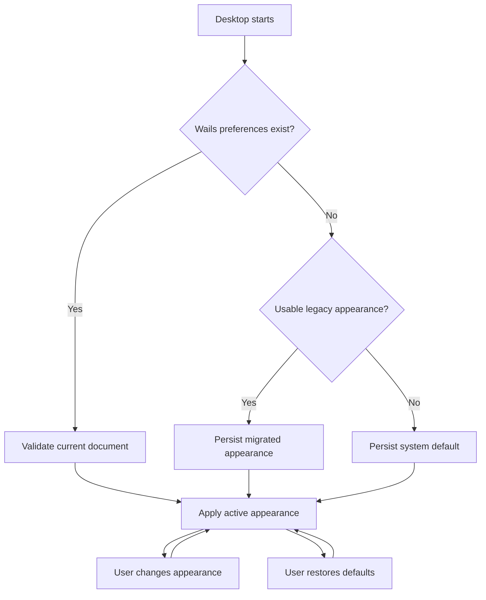

# Data Model: Desktop Settings, Information, and Recovery

## DesktopPreferences

- `version`: current document schema version
- `appearance`: `system`, `light`, or `dark`
- `transition`: PreferenceTransition

Invariant: unsupported versions and appearance values never become active application state.

## PreferenceTransition

- `status`: `migrated`, `not_found`, `invalid`, `unreadable`, or `not_required`
- `retired`: stable list containing legacy font and scroll-sensitivity keys when legacy state was inspected

Invariant: the transition is informational and contains no raw file content or secret data.

## SettingsWorkspace

- `preferences`: active DesktopPreferences
- `preferencePath`: exact current Wails preference file path
- `storage`: ordered StorageRecord collection
- `product`: ProductInformation
- `daemonAvailable`: whether authoritative daemon runtime metadata was loaded
- `loadedAt`

Invariant: local sections remain complete when daemon metadata is unavailable; daemon-owned records explicitly carry unavailable state.

## StorageRecord

- `id`: stable backend identifier
- `label`
- `path`: exact authoritative path or empty when unavailable
- `owner`: `go-schedule`, `desktop`, `operating-system`, or `external`
- `scope`: `machine`, `user`, `runtime`, or `external`
- `existence`: `present`, `absent`, or `unavailable`
- `normalRemoval`
- `explicitWipe`
- `copyable`: true only when an exact current path is available

Invariant: no record claims removal of external content, and daemon records never contain inferred fallback paths.

## ProductInformation

- `name`
- `version`
- `publisher`
- `links`: ordered ProductLink collection

## ProductLink

- `key`: stable backend-defined identifier
- `label`
- `destination`: fixed HTTPS destination included for display

Invariant: open actions resolve `key` against the backend allowlist and do not trust a frontend-provided destination.

## NativeActionResult

- `action`
- `outcome`: `accepted`, `rejected`, or `unavailable`
- `message`
- optional refreshed SettingsWorkspace

## ConnectionViewState

- existing ConnectionSnapshot from the connection manager
- `retryPending`
- `announcement`

Invariant: only one retry is pending, and a status refresh never changes the active route or selected control.

## Preference Lifecycle

