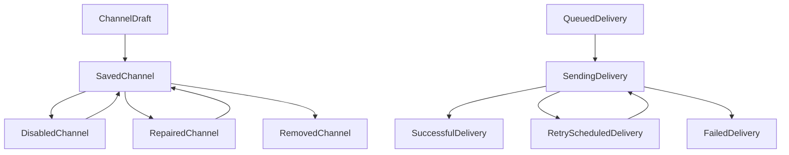

# Data Model: Desktop Notification Management

## NotificationChannelSummary

- `id`: stable channel identity
- `name`: user-facing channel name
- `kind`: webhook
- `endpointSummary`: redacted destination summary
- `hasAuthorization`: whether a protected authorization value exists
- `enabled`: whether new delivery work may be created
- `updatedAt`: stable timestamp for presentation

The model intentionally has no endpoint or authorization field.

## ChannelDraft

- `id`: empty for create, stable identity for edit
- `name`: required trimmed name
- `endpoint`: write-only create or replacement value
- `authorization`: write-only create or replacement value
- `replaceEndpoint`: explicit endpoint replacement intent for edit
- `replaceAuthorization`: explicit authorization replacement or clearing intent for edit
- `isNew`: create versus update mode

Create requires a non-empty HTTPS endpoint. Edit ignores blank protected inputs unless their replacement flag is set. Authorization replacement may be blank to clear it; endpoint replacement may not be blank.

## PolicyScope

- `type`: task or group
- `id`: stable scope identity
- `name`: user-facing name
- `context`: group hierarchy or task group context

## AssignmentDraft

- `channelId`: selected channel identity
- `onSuccess`: production success outcomes selected
- `onFailure`: production failure outcomes selected

Each saved assignment requires at least one outcome. The complete array atomically replaces the selected scope's direct assignments.

## PolicyDetail

- `scope`: selected task or group
- `directAssignments`: assignments configured directly on the scope
- `effectiveSourceType`: task, group, or none
- `effectiveSourceId`: authoritative selected source identity
- `effectiveSourceName`: resolved safe display name
- `effectiveAssignments`: authoritative task policy, or the direct group policy for a group

For tasks, any non-empty direct assignment list overrides group inheritance. Clearing it allows the server to select the nearest configured group ancestor. For groups, descendant inheritance is explanatory and no alternate effective group policy is calculated.

## DeliveryRecord

- `id`: stable delivery correlation identity
- `channelId`, `channelName`, `destinationSummary`: redacted destination context
- `kind`: test or task outcome
- `taskId`, `taskName`, `groupId`, `groupName`, `runId`: optional production correlation
- `state`: queued, retrying, sending, successful, or failed
- `attempts`: attempted-send count
- `nextAttemptAt`, `createdAt`, `claimedAt`, `completedAt`: available lifecycle times
- `lastStatus`: receiver HTTP status when available
- `lastError`: safe final failure detail when available

The model intentionally has no endpoint, authorization, or payload field.

## NotificationWorkspace

- `channels`: ordered channel summaries
- `tasks`: ordered task policy scopes
- `groups`: hierarchy-aware group policy scopes
- `deliveries`: newest-first bounded delivery records
- `loadedAt`: complete snapshot time

The workspace is replaced only by a complete successful read.

## NotificationResult

- `action`: stable operation name
- `outcome`: accepted, rejected, conflict, stale, or unavailable
- `message`: bounded user-safe explanation
- `field`: optional validation field
- `entityId`: optional channel or scope identity
- `workspace`: optional complete refreshed workspace
- `policy`: optional selected policy detail

## State transitions

