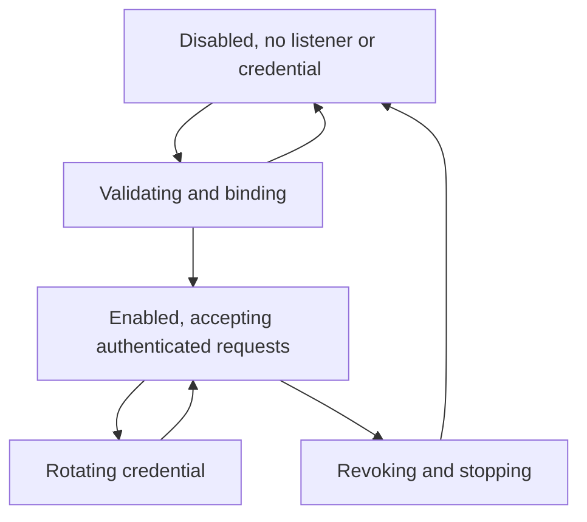

# Data Model: Authenticated Localhost MCP

## Endpoint Status

| Field | Type | Rules |
| --- | --- | --- |
| `enabled` | boolean | False on daemon construction and after disable or shutdown |
| `endpoint` | string | Empty when disabled; otherwise `http://127.0.0.1:<port>/mcp` |
| `allowed_origins` | string array | Canonical sorted exact loopback origins, never wildcard |
| `credential_fingerprint` | string | Empty when disabled; short non-secret SHA-256 prefix when enabled |
| `enabled_at` | UTC timestamp | Empty when disabled |

## Enable Request and Response

An enable request contains a port and zero or more browser origins. The successful response contains Endpoint Status plus a one-time plaintext credential. Validation and bind complete before state becomes enabled. A failure publishes no partial state or credential.

## Credential State

The manager retains a fixed-size SHA-256 digest while enabled. Enable and rotation generate 32 random bytes and return their unpadded base64url encoding once. Verification hashes the received token and compares fixed-size digests in constant time. Rotation atomically swaps the digest and fingerprint; disable and shutdown zero the active digest state before closing the server.

## Lifecycle State Machine

Only one lifecycle mutation holds the manager lock at a time. Status returns an immutable copy. Enable while enabled is conflict. Disable while disabled succeeds. Unexpected serve termination revokes state and returns to disabled.

## Origin Policy

Each configured origin is parsed as an absolute `http` or `https` URL with no user information, query, fragment, or non-root path. Its hostname must be exactly `127.0.0.1`, and its port must be explicit and valid. Canonical origins use browser serialization, which omits port 80 for HTTP and port 443 for HTTPS, then are deduplicated and sorted. An absent request Origin is allowed; any present value must equal one canonical configured string.
