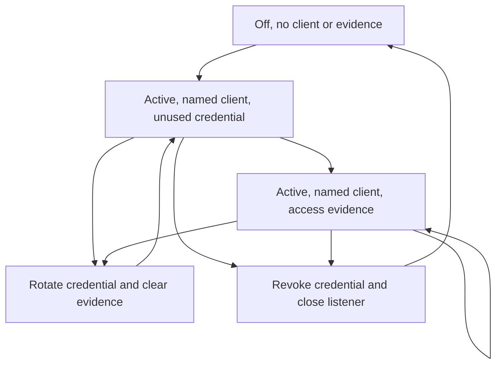

# Data Model: Agent Access Controls and MCP Release Gates

## Localhost MCP status additions

| Field | Type | Rules |
| --- | --- | --- |
| `client_name` | string | Empty while disabled; otherwise 1 through 64 UTF-8 bytes, trimmed, no control characters |
| `request_count` | unsigned integer | Successful authenticated non-preflight requests for the current credential generation; saturates at maximum |
| `last_accessed_at` | UTC timestamp | Empty until the first successful authenticated non-preflight request |

These fields join the existing enabled flag, endpoint, origins, fingerprint, and activation timestamp. They contain no credential or request content.

## Enable request

`client_name` is additive and optional for compatibility. An omitted or blank caller value becomes `Local MCP client` for existing CLI and JSON callers. The desktop requires explicit nonblank input before it invokes enablement.

## Runtime state transitions

Enable publishes a validated name with zero count and no last-access time. Successful authorization updates evidence under the manager lock. Rotation preserves the name, endpoint, origins, and activation time but installs a new digest and clears evidence. Disable, shutdown, unexpected listener stop, and restart clear all fields.

## Agent Access workspace

| Section | Data | Authority |
| --- | --- | --- |
| Stdio | command, on-demand availability, no-listener explanation | Informational only |
| Localhost HTTP | safe daemon status and lifecycle controls | Existing protected local IPC |
| Permission classes | Observe available; Operate and Manage unavailable | Informational only |
| Guidance | fixed local documentation destination | Existing allowlisted native browser action |

The workspace never contains a plaintext credential. Enable and rotate produce a backend-only credential response that is copied to the clipboard before the safe workspace is returned.

## Operation state

Desktop lifecycle actions are serialized. Each result has an action, accepted/rejected/unavailable outcome, bounded message, and optional non-secret workspace. If enable or rotation succeeds at the daemon but clipboard copy fails, rollback invokes disable and returns unavailable only after the best-effort fail-closed transition completes.
