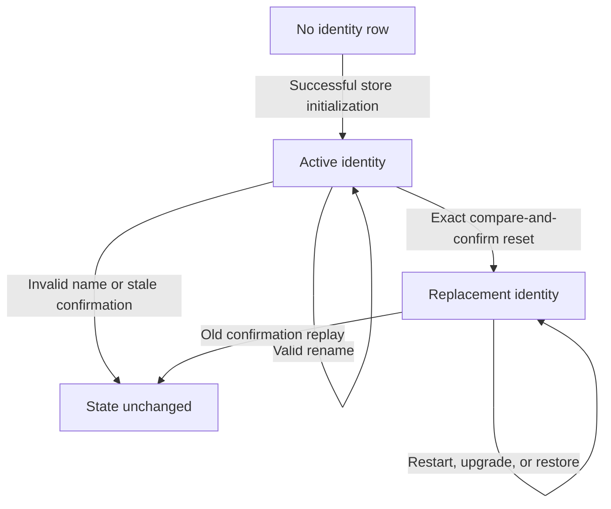

# Data Model: Stable Daemon Identity and Capability Manifest

## DaemonIdentity

The store contains exactly one row representing one logical daemon.

| Field | Type | Constraints | Meaning |
|---|---|---|---|
| `singleton` | integer | Primary key, must equal `1` | Enforces one identity row |
| `installation_id` | text | Nonempty, unique, valid UUID | Opaque stable daemon identity |
| `display_name` | text | Trimmed, 1-80 Unicode code points, no controls | Editable operator-facing label |
| `created_at` | text | UTC RFC3339 timestamp | Initial identity creation time |
| `updated_at` | text | UTC RFC3339 timestamp | Last rename or reset time |

### Invariants

- Exactly one singleton row exists after a successful store open.
- Installation identity is unrelated to scheduler-object IDs and machine properties.
- Rename changes only `display_name` and `updated_at`.
- Reset changes only `installation_id` and `updated_at`.
- Migration, restart, upgrade, and database restore retain the stored row.
- Persistence or generation failure aborts the operation without an in-memory substitute.

### State transitions

## CapabilityManifest

The manifest is a read-only response projection assembled from persisted identity and build/runtime constants. It is not stored as a second source of truth.

| Field | Source | Rule |
|---|---|---|
| `installation_id` | `DaemonIdentity` | Exact opaque UUID |
| `display_name` | `DaemonIdentity` | Exact validated name |
| `product_version` | Build metadata | Report verbatim |
| `local_api_versions` | API contract | Sorted, contains `v1` |
| `remote_api_versions` | Delivery stage | Empty in S075 |
| `operating_mode` | Delivery stage | `local_only` in S075 |
| `capabilities` | Product contract | Sorted and duplicate-free |
| `platform.os` | Go runtime | Normalized safe OS name |
| `platform.architecture` | Go runtime | Safe architecture name |

The projection excludes identity timestamps because clients do not need them, and excludes all hostnames, addresses, paths, accounts, environment values, configuration, credentials, trigger keys, commands, and scheduler records.

## IdentityResetRequest

| Field | Type | Constraints | Meaning |
|---|---|---|---|
| `confirm_installation_id` | string | Must exactly equal the currently stored identifier | Compare-and-confirm guard |

A successful reset returns the resulting manifest. A stale or mismatched confirmation produces a conflict and no mutation.
