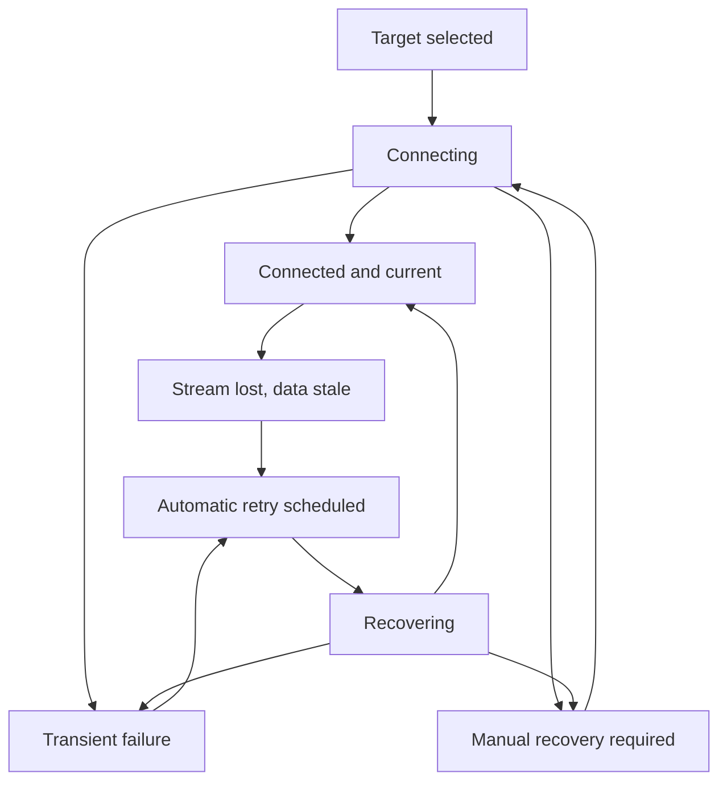

# Data Model: Resilient Remote Connections

## Connection Snapshot

| Field | Type | Rule |
| --- | --- | --- |
| generation | unsigned integer | Increases for every connection attempt and target switch |
| revision | unsigned integer | Increases for every published state change within or across generations |
| state | connection state | Uses the complete classified state vocabulary |
| target | Target | Secret-free immutable identity for the selected local or remote daemon |
| message | string | Safe current-state explanation |
| action | optional string | Manual recovery guidance when useful |
| lastSuccessfulAt | optional RFC 3339 timestamp | Last validated successful contact for this target |
| stale | boolean | True when retained daemon data is no longer known current |
| retryAttempt | non-negative integer | Zero when no automatic retry is scheduled |
| nextRetryAt | optional RFC 3339 timestamp | Scheduled automatic retry deadline |
| recovery | recovery mode | `none`, `automatic`, or `manual` |

### State transitions

Only the current generation may transition state. Target switch and shutdown cancel the active attempt, stream, and retry timer.

## Retry Policy

| Field | Rule |
| --- | --- |
| attempt | Starts at one for the first scheduled retry and increases until stable activity |
| baseDelay | Sub-second production default |
| maximumDelay | Thirty seconds |
| jitter | Bounded additive or symmetric variation that cannot exceed the maximum delay |
| retryable | True only for transport, timeout, daemon restart, and ordinary stream loss |

## Mutation Uncertainty

| Field | Rule |
| --- | --- |
| operation | Safe HTTP method and route template or desktop action name |
| remote | Always true for this classification |
| message | States that the operation may have completed and must not be retried blindly |
| cause | Retained for programmatic inspection but never serialized or displayed |

An authoritative non-success HTTP response is a rejection, not uncertainty. Local IPC failures retain their existing unavailable classification.

## Connection Profile

No schema version change is required. S079 writes the existing optional `last_successful_at` field after validated remote connection success. Credential, phrase, private-key, and daemon workspace data remain excluded.

## Authoritative Workspace Snapshot

Existing feature workspace objects remain in frontend memory. Freshness belongs to the global connection snapshot rather than duplicating fields into every feature model. A workspace is current only when its target generation matches a connected snapshot and its latest read completed after that generation connected.
