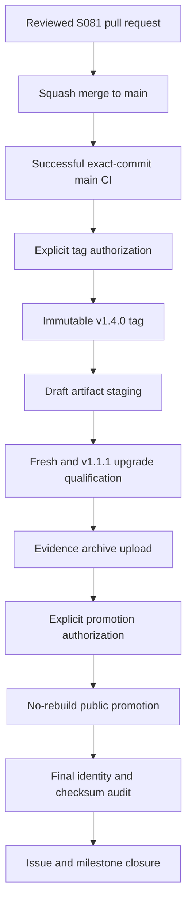

# Data Model: Cumulative v1.4.0 Release Preparation

## Release boundary

| Field | Rule |
| --- | --- |
| Public predecessor | `v1.1.1` |
| Target | `v1.4.0` |
| History shape | One cumulative dated section after an empty Unreleased section |
| Source commit | Reviewed S081 squash merge commit on `main` |
| Intermediate milestones | Preserved as delivery history, not synthesized releases |

## Release metadata

| Surface | Required identity |
| --- | --- |
| README health example | `1.4.0` |
| Changelog heading | One dated `[1.4.0]` section |
| Changelog comparison | `v1.1.1...v1.4.0` |
| Release note | Four one-line highlights plus one tagged changelog link |
| Git tag | `v1.4.0`, absent until separately authorized |

## Draft artifact set

The draft contains four daemon and CLI archives, two Wails desktop archives, one Windows MSI, and one Windows candidate manifest. Qualification adds one attended evidence archive. Promotion adds one checksum inventory that covers every other public asset exactly once.

## Windows upgrade baseline

| Field | Rule |
| --- | --- |
| Baseline artifact | Public `go-schedule_v1.1.1_windows_amd64.msi` |
| Candidate artifact | Draft `go-schedule_v1.4.0_windows_amd64.msi` |
| Preserved state | Tasks, run history, supported appearance intent, daemon identity, actor and credential records, notification configuration, remote configuration |
| Default-off proof | No notification channel, localhost MCP listener, or remote HTTPS listener enabled by upgrade alone |
| Native observations | All 47 established attended scenario identities pass against the exact candidate |

## Publication lifecycle

Failure cannot advance the lifecycle. The safe retained states are reviewed source before tagging and an unpublished draft after staging.
