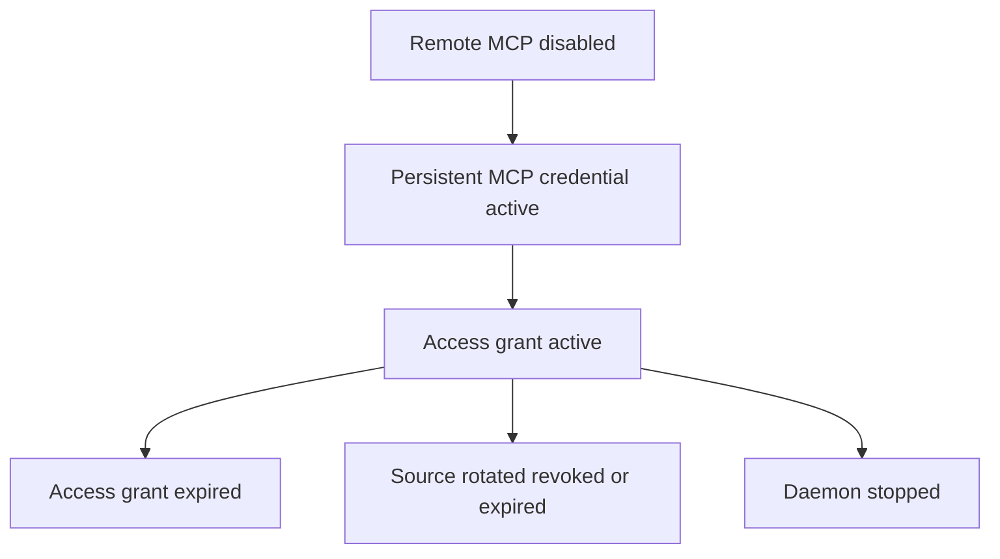

# Data Model: Remote MCP Authorization

## Remote MCP configuration

| Field | Type | Rule |
| --- | --- | --- |
| Enabled | boolean | Defaults false and is effective only when remote HTTPS is enabled |
| ResourceURL | string | Exact canonical HTTPS URL ending in `/mcp`, with no user information, query, or fragment |
| AccessTokenLifetime | duration | Positive bounded duration with a secure default and maximum |

## Access grant

| Field | Type | Rule |
| --- | --- | --- |
| TokenDigest | 32 bytes | SHA-256 of a random 256-bit opaque access token |
| Resource | URL | Exact configured MCP resource |
| DaemonID | UUID | Installation identity at issuance |
| CredentialID | UUID | Exact persistent MCP source credential |
| CredentialDigest | 32 bytes | Digest used to revalidate rotation or revocation without retaining the client secret |
| ActorID | UUID | Persistent MCP actor used for API authorization and audit |
| Capability | enum | Observe, Operate, or Manage derived from granted scopes |
| Scopes | string set | Monotonic MCP scope set bounded by capability |
| IssuedAt | timestamp | UTC issuance time |
| ExpiresAt | timestamp | UTC bounded expiry |

## State transitions

All terminal states reject the access token. A new token requires another standard token exchange using a currently active persistent MCP credential.

## Scope mapping

| Requested highest scope | Emitted scopes | Required actor capability |
| --- | --- | --- |
| Observe | `mcp:observe` | Observe |
| Operate | `mcp:observe mcp:operate` | Operate |
| Manage | `mcp:observe mcp:operate mcp:manage` | Manage |
