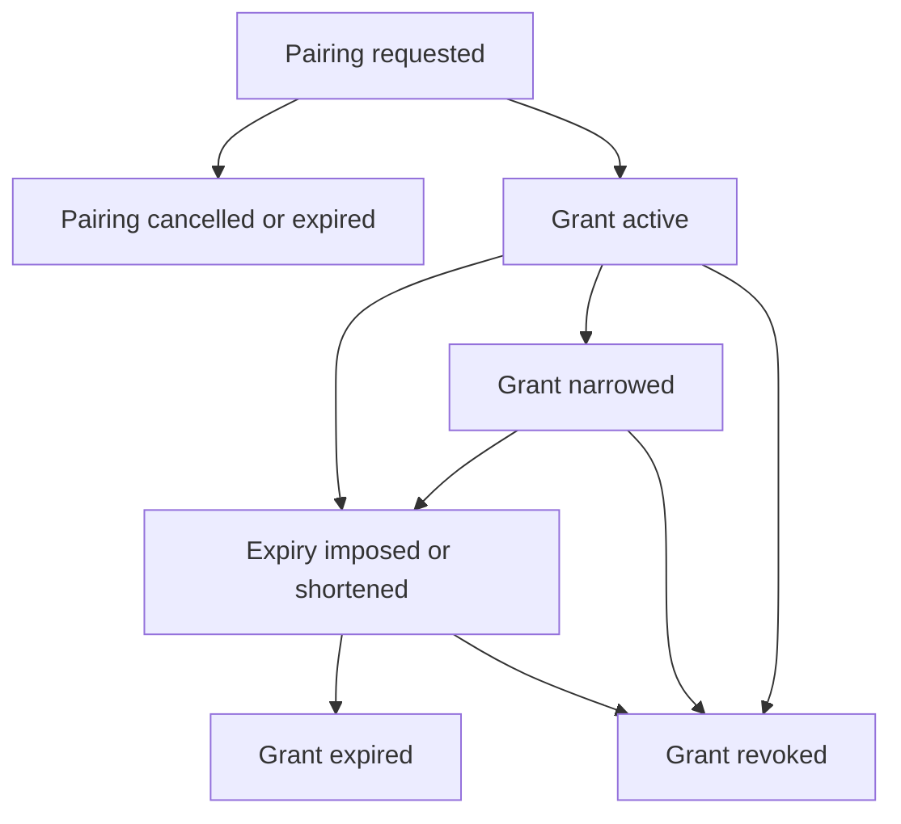

# Data Model: Agent Grant Controls

## Pairing session extension

| Field | Type | Rule |
| --- | --- | --- |
| GrantExpiresAt | optional timestamp | Future deadline approved at pairing creation; null means deliberate non-expiring access |

The existing ExpiresAt remains the ten-minute enrollment deadline. GrantExpiresAt is copied to the actor only after successful exchange.

## Agent grant projection

| Field | Source | Rule |
| --- | --- | --- |
| ActorID | actor | Stable grant identity |
| ClientName | actor | Validated display name |
| DaemonID and name | daemon manifest | Explicit target identity |
| Capability | actor | Observe, Operate, or Manage |
| Transport | credential and listener correlation | Stdio, Localhost HTTP, or Remote HTTPS |
| CreatedAt | actor | UTC creation time |
| LastUsedAt | credential, localhost status, or newest audit | Optional safe evidence |
| ExpiresAt | actor | Optional persistent deadline |
| State | actor | Active, Expired, or Revoked |
| CredentialFingerprint | credential | Optional safe identifier for Remote HTTPS only |

## Recent action projection

| Field | Source | Rule |
| --- | --- | --- |
| DaemonID | audit event | Must match the target daemon |
| Operation | audit event | Stable operation identifier |
| TargetKind and TargetID | audit event | Bounded object identity |
| Result | audit event | Uncertain, succeeded, failed, or denied |
| OccurredAt | audit event | UTC occurrence time |

## Lifecycle

Expired and revoked are terminal from the desktop control. New or expanded authority requires a new pairing.
